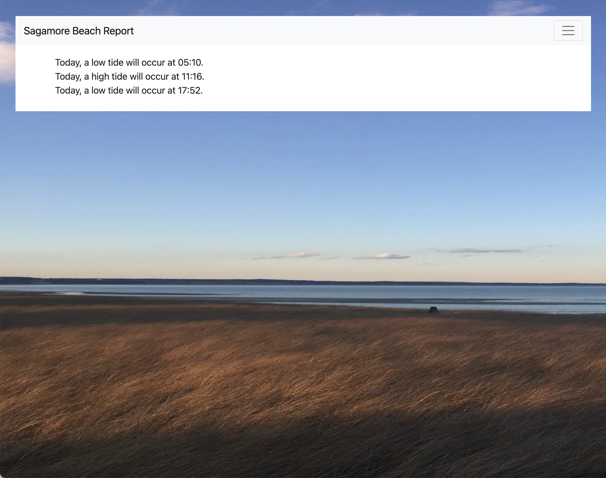

# Sagamore Beach Report 2

This is a remake of [Sagamore Beach Report](https://github.com/ryandrew14/sagamorebeachreport) that is made for new web developers to better understand the basics of HTML, CSS, and JS.

## Running the website

The website is 100% static, meaning you don't need any extra program to run it. Just right click on index.html in Finder and click "Open With" and scroll to Google Chrome.

## Screenshot

